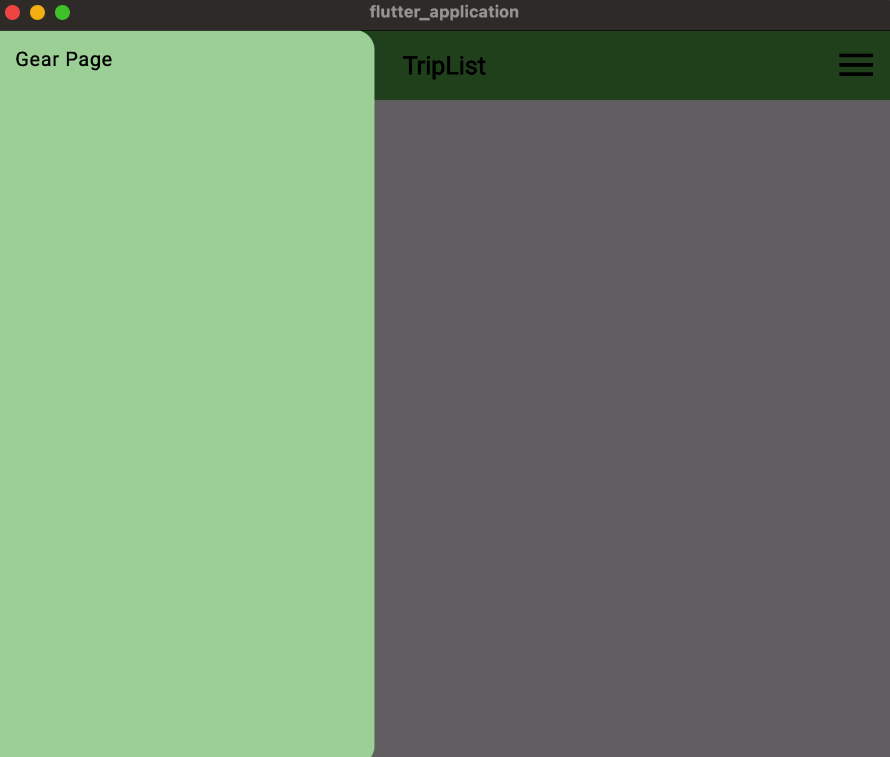
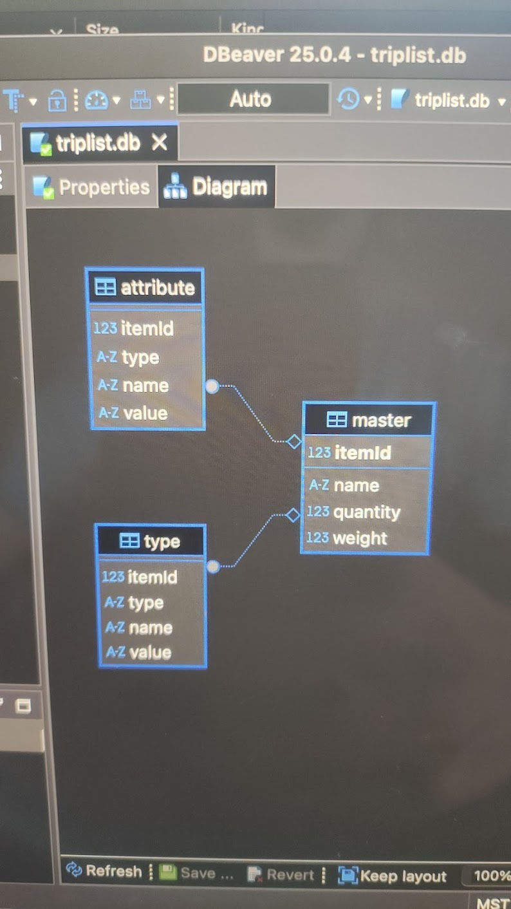
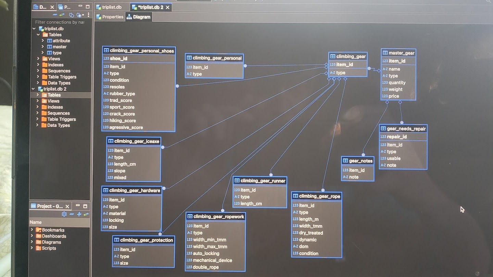
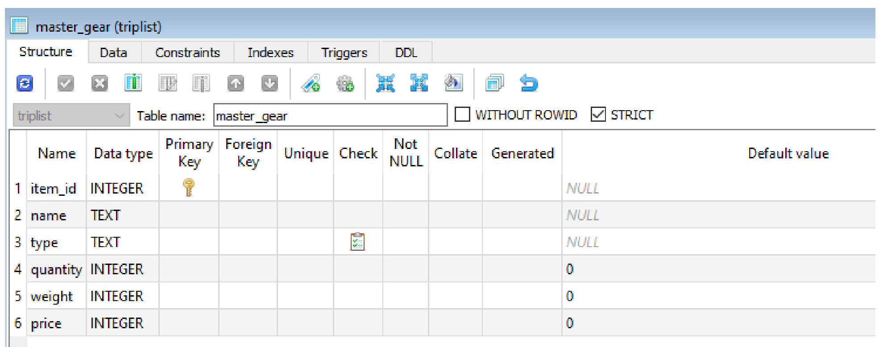

# TripList version history and development

## v1.3 (June 7, 2025)
Moving to version 1.3. I will be scaling back the project to get a minimum viable product up and running, I've been spending too much time working on features that aren't critical to the function of the app but the app doesn't work yet.
See [README](./README.md) for MVP goals

Current homepage and functional menu:

## v1.2 (May 6, 2025)
Version 1.2 of triplist is now under development!
- new database structure is more flexible and scalable than the old (and far less complicated!)

  
  
  

## v1.1 (April 17, 2025)
Version 1.1 of triplist is now under development!
- using Drift for better database management
- improved code structure
- less boilerplate code
- continuing to use SQLite GUI for database creation and development

## v1.0 (April 17, 2025)
see v1.0 here: https://github.com/flameofanor/Trip_List_v1.0
(not functional in current state)

basic structure of master gear table!

